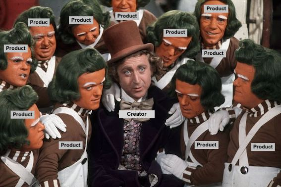

# Factory Method

  

 

## Definición
El patrón **Factory Method** permite resolver de manera simple, la forma de crear un objeto complejo o que varíe dependiendo condiciones en tiempo de ejecución.
 
Podemos decir que el objetivo es ocultar a los usuarios la forma en que se crean los objetos. Además, también permite, que su comportamiento se adapte condiciones en tiempos de ejecución.

## Componentes principales
**Product:** Son los diferentes tipos de objetos que pueden ser creados. Por ejemplo, en un sistema de mensajería, existirían clases como Whatsapp, Telegram, SMS, email, etc.
 
**Creator:** Son las objetos que tienen la lógica necesaria para crear una instancia de los *Product*.

## Condiciones
- Todos los *Product* deben cumplir con la misma interfaz, es decir todos deben tener los mismos métodos con parámetros y valores de retorno.
- Los *Product* sólo pueden ser creadas en los *Creator*.
- Si bien no es una condición, es deseable que los *Creator* implementen una clase abstracta en donde compartirán funcionalidad en común( Don't repeat yourself ).

## Ejemplos prácticos
 
- Un componente que se conecte a la base de datos: En este escenario debemos proveer usuario, contraseña y base de datos cada vez que queremos conectarnos. Para evitar enviar esa información una y otra ves lo que hacemos es colocar la lógica de obtener los datos ( usuario, password y base de datos ) en el *Creator* y devolvemos una conexión a la base de datos abierta el cual sería nuestro *Product*

- Un componente que registra Logs dependiendo el tipo de error sucedido: Nuestro negocio necesita que se registren, por un lado los errores de nuestro negocio ( por ejemplo, saldo insuficiente en tarjeta, datos inválidos o producto sin stock ) y por otro lado los errores de la aplicación ( time out, base de datos no existen, excepciones ). Para resolver esto, nuestro *Creator* recibe un parámetro que indica que tipo de log vamos a utilizar ( negocio o aplicación ) para entregarnos el *Product* correcto.