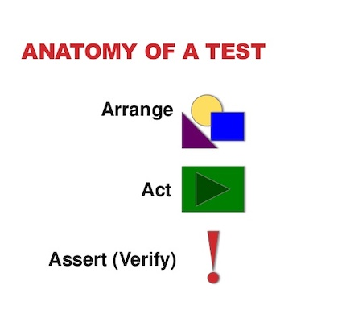
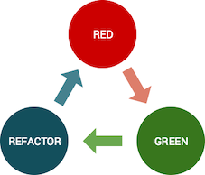

Un ***unit test***, como vimos en la introducción, es un segmento de código que realiza una verificación de una única ( en lo posible ) expectativa. 
 
Durante el desarrollo de un componente de software vamos a crear muchos ***unit test*** para cubrir diferentes casos de uso. La cantidad de unit test a crear dependerá de las especificaciones que hayamos recibido. Por ejemplo, en el caso de una calculadora podemos ver esta historia de usuario:
 
*"Como estudiante de matemática necesito que mi calculadora realice sumas para poder cumplir con las tareas asignadas por mi profesor."*
 
De la forma en que está escrita la historia podemos crear desde un solo ***unit test*** que verifique la suma hasta casos de sumas entre positivos, suma entre negativos y entre positivos y negativos.

## Como nombrar un test

Tal cual una función o un método, un ***unit test*** tiene un nombre y este puede ser el que quisiéramos colocar. Pero, tal cual lo hacemos con las funciones, es importante que el nombre de un test unitario contenga lo que realiza o en nuestro caso los que recibe como entrada y lo que devuelve como salida. Podemos mencionar algunos ejemplos de nombres que son válidos para un ***unit test*** que realiza una suma:
 
- "Cuando sumó 1 + 1 debo devolver 2"
- "Cuando recibo dos valores debo devolver la suma de ambos"
- "Devuelvo el resultado de la suma cuando recibo dos valores de entrada"

Todos los casos pueden ser válidos, es necesario que seamos sabios para colocar nombres que describan lo mejor posible la prueba que estamos realizando.

## Estructura de un test

Un ***unit test*** se organiza internamente en tres secciones principales. Cada una de ellas cumple con un propósito dentro de la prueba:
<p align="center">
  
</p> 

- *Arrange:* Es la sección donde vamos a realizar la preparación de nuestro entorno, aquí es donde se declaran todas las condiciones que el unit test va a necesitar para funcionar.
 
- *Act:* Es la ejecución de la prueba propiamente dicha. Esta ejecución deberá, al finalizar, entregar un resultado que será evaluado en la próxima sección.
 
- *Assertion:* Momento donde realizamos la verificación del resultado, es aquí donde comparamos el valor que obtuvimos al ejecutar la prueba ( en el paso anterior ).

```javascript
import { add } from "../calculator"

describe("calculator", () => {
    it("Must return two when add one to one", ()=> {
        // Arrange
        const firstInput = 1
        const secondInput = 2

        // Act
        const actalResult = add(firstInput,secondInput)
        
        // Assert
        expect(actualResult).toEqual(2);
    })
})
```

## red-green-refactor
Escribir un ***unit test*** lleva repetir los mismos tres pasos una y otra vez hasta conseguir el balance entre pocas líneas, código legible y performante. Es importante respetar estos pasos para poder lograr cumplir con ese balance.
<p align="center">
  
</p>

1. *RED:* Este paso se llama rojo debido a que el objetivo del mismo es crear un unit test que falle. La falla va a corresponder a que aún no existe código en nuestro proyecto que cumpla con las expectativas del mismo.
 
2. *GREEN:* Luego de cumplido el primer paso, realizamos la implementación mínima en nuestro código para que ese unit test cumpla con su expectativa. No es necesario que sea bonito o performante, solo debe funcionar y pasar el unit test.
 
3. *REFACTOR:* Teniendo un unit test en verde y la funcionalidad mínima procedemos a mejorar nuestro código para que quede prolijo y sea performante.

Una vez cumplido los tres pasos podemos continuar incrementando la cantidad de ***unit tests*** de nuestro componente para cubrir casos de uso diferentes.

## Principio FIRST

Un ***unit test*** debe respetar con algunos criterios importantes representados por este el principio [FIRST](https://www.paradigmadigital.com/dev/principio-first-aumentar-la-calidad-tests-unitarios/):

<p align="center">
  
</p>

*Deben ser rápidas debido a que queremos ejecutarlos seguido.* Imaginemos que estamos mejorando la performance de un componente, con cada cambio vamos a ejecutar todos los ***unit tests*** del componente y queremos tener el resultado lo antes posible.

*Deben ser independientes*, no deben estar atados a un entorno ni a una orden de ejecución específica. Un ***unit test*** debe poder correr solo o en conjunto con otros y tanto local como en un entorno de deploy a producción.

*Debe poder ser repetitivo*, sin importar la cantidad de veces que se ejecute el resultado siempre debe ser el mismo si no hubo cambios.

*Se debe auto-validar*, al finalizar la ejecución de un ***unit test*** se debe conocer el resultado del mismo. No es una opción válida que un test no devuelva un resultado o que el resultado del mismo se vea plasmado en otra prueba unitaria.

Debe ser escrito en el momento oportuno. Siempre debe existir un ***unit test*** para un caso de uso a desarrollar pero también es importante que no existan ***unit test*** si no se va a desarrollar el código que cumpla con esa expectativa.