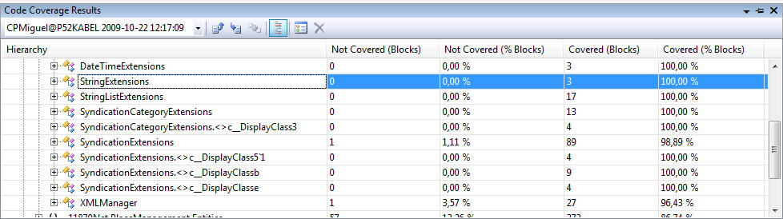
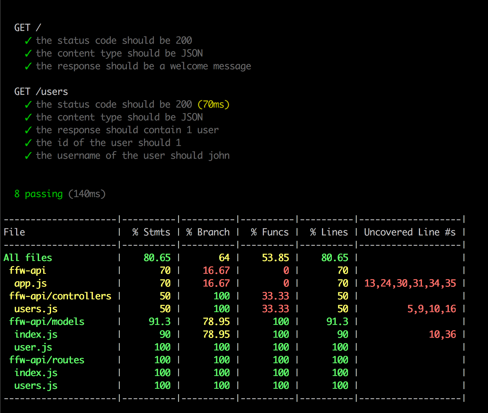
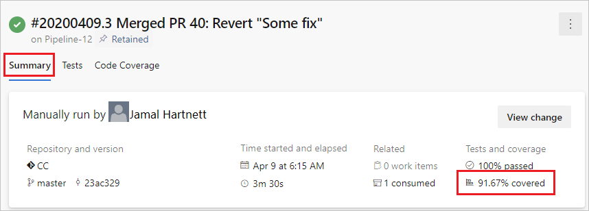

## Ejecución de pruebas unitarias en diferentes entornos

La ejecución local de los test tiene casi completamente como objetivo validar los cambios que estamos realizando en nuestro código. Respetando la pirámide de red-green-refactor con lo cual nos va a resultar útil solamente ejecutar los test que correspondan al componente que estamos tocando. En este entorno es en donde nosotros, los devs, sacamos provecho a las pruebas unitarias escritas.
 
Cualquier mejora, refactor o incremento de la funcionalidad del componente estará cubierto ( dependiendo del code coverage ) por las pruebas unitarias.
 
Durante un escenario de integración continua, la ejecución de los test unitarios aseguran que todos los casos de uso esperados del componente se siguen cumpliendo. Esto permite conocer a las áreas de calidad que al menos lo que antes funcionaba aún debería seguir haciéndolo.
 
Otro escenario donde podemos sacar provecho de las pruebas unitarias es en continuos delivery. Al momento de programar un deploy a un entorno nuestras pruebas unitarias pueden ejecutarse para validar que el producto que vamos a entregar cumpla con los casos de usos que cada componente tiene redactado. Las herramientas de continuous delivery tienen forma de ejecutar, analizar y proceder dependiendo de los resultados de los test.

## Métricas

La principal métrica de TDD es el code coverage, este valor es el porcentaje de líneas de código en nuestro proyecto que están avaladas por al menos una prueba unitaria. Es decir...
 
"Si nuestra aplicación tiene 1000 líneas de código y nuestros test solo verifican el funcionamiento de 400, mi code coverage es de 40%).
 
Cuanto más alto sea el porcentaje de code coverage de nuestro proyecto mayor será su calidad y menor su complejidad. Un valor promedio ( según mi experiencia ) aceptable puede comenzar desde un 70% teniendo en cuenta que es muy difícil conseguir un 100%

## Visual Studio code coverage analysis

  

 

## Mocha output test result ( NodeJs)

  

 

## Azure devops pipeline build result

  

 

